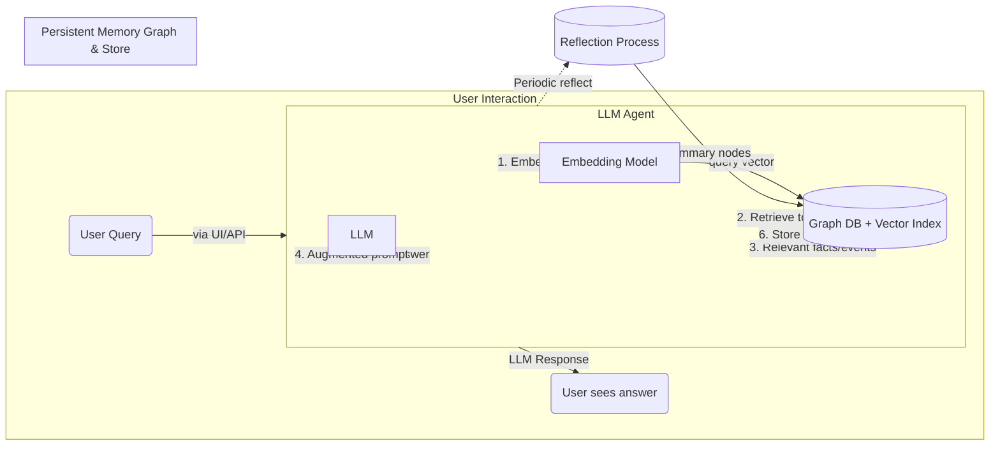

## This contains an executive summary followed by a blueprint for the project I wish for you to make 

## Executive Summary

This report explores the feasibility and design of a next-generation Large Language Model (LLM) agent with **persistent, graph-based memory**. The proposed system uses an **append-only property graph** as the sole knowledge store for the agent’s cognition and self-reflection. We target the open-source **Qwen 3** LLM family (released under Apache-2.0) running locally on consumer GPU hardware. The agent continuously writes all interactions and learned facts to a graph database, enabling long-term memory beyond the LLM’s fixed context window. Key benefits include structured storage of knowledge (entities, relationships, timestamps) and explicit support for multi-hop reasoning via graph queries. Challenges include ensuring real-time performance on local GPUs, managing unbounded memory growth, and designing effective strategies for retrieving the most relevant context from the graph for each new query.

**Solution Overview:** We propose an **integrated memory architecture** combining a property graph and vector search. The graph (in Neo4j, Memgraph, or similar) stores nodes for **episodic memories** (conversations, events), **semantic memories** (facts, summaries), and **procedural memories** (agent instructions) with edges denoting relationships (e.g. temporal order, reference links). Each memory node also carries an **embedding vector** for semantic similarity search. When a user query arrives, the agent uses a hybrid retrieval policy: it finds recent nodes (to exploit recency) and performs **vector similarity search** for semantically relevant nodes, possibly filtered by node type or importance. Retrieved graph substructures are then assembled into the LLM’s prompt context. After generating a response, the new interaction (user query and answer) is appended to the graph. In the background, **metacognitive routines** run periodically: the agent reflects on accumulated memories (e.g. summarizing a day’s events, extracting high-level insights) and appends these as new graph nodes. Crucially, no data is ever deleted: instead, knowledge updates are handled by adding new nodes/edges and marking old information as superseded, preserving a complete history for verifiability.

> <span style="color:teal;"><strong>Key Takeaway:</strong> This design marries a knowledge graph’s structured, **evolving memory** with LLM flexibility, enabling an agent to **remember, reason, and reflect** over long periods entirely on local hardware.</span>

## Literature & Prior-Art Review

**Graph-Based Memory for LLMs:** Research since 2018 highlights the synergy between knowledge graphs and language models. Knowledge graphs (KGs) store facts as triples or property graphs, offering **structured relationships** that can improve retrieval and reasoning. Early works on integrating KGs with LLMs showed that injecting structured knowledge can reduce hallucinations and improve factuality. Recent Microsoft Research on **Graph-RAG (Graph Retrieval-Augmented Generation)** demonstrated that LLM-generated knowledge graphs can outperform pure vector search in complex Q\&A tasks. GraphRAG uses the LLM to populate a KG from input documents and performs graph traversals at query time, enabling **multi-hop question answering** and discovery of hidden connections. Neo4j and Memgraph have embraced this paradigm: Memgraph’s documentation notes that knowledge graphs provide richer context and multi-hop traversal for RAG systems compared to flat vector stores. Both Neo4j and Memgraph introduced native vector indexing recently, underscoring a trend toward **unifying graph and vector search** in one engine.

Academic prototypes of **persistent agent memory** have emerged. Mai et al. (2023) describe a “Grounded Memory System” combining a knowledge graph with a vector store to assist a personal assistant agent. Their system stores multimodal observations in Neo4j (with new nodes for each image and text) and attaches embeddings for semantic search. They report that using Neo4j both as the graph DB and as a vector index was feasible, achieving interactive performance on local hardware. Rasmussen et al. (2025) introduce **Zep: a temporal knowledge graph memory** service for LLM agents. Zep’s core, **Graphiti**, is a bi-temporal graph engine (built on Neo4j) that stores dialogues and structured data with time metadata. Notably, Graphiti never deletes old information; instead it marks outdated facts with an `t_invalid` timestamp, preserving the historical graph. This approach achieved state-of-the-art long-term recall: Zep outperformed the MemGPT system on a deep memory retrieval benchmark (94.8% vs 93.4% accuracy) while cutting response latency by 90%. **Graphiti’s low-latency memory** (95th percentile \~300 ms) comes from hybrid search (semantic + keyword + graph traversal) that avoids repeated LLM calls for lookup. These results validate that a well-designed graph-memory layer can significantly extend an LLM’s effective context length without cloud resources.

**LLM Agents with Long-term Memory:** The community has also built open-source frameworks to give LLMs a memory across sessions. **MemGPT** (Packer et al. 2024) pioneered an “LLM as Operating System” concept. MemGPT manages a **hierarchical memory**: it treats the LLM’s prompt as fast RAM and an external vector store as disk, with the LLM itself deciding when to swap information in or out. This is done via special function calls: for example, MemGPT’s controller can interrupt the LLM generation to invoke a memory search or save operation. In experiments, MemGPT agents could remember facts across arbitrarily long dialogues by retrieving needed information from a “recall buffer” of embeddings. However, MemGPT’s memory was essentially a **list of past conversations indexed by embedding** – it lacked an explicit knowledge graph of how facts relate. An HN review of “Memary” (an open-source memory layer) noted that simply linking complete past responses by similarity is *“a graph-structured search index for sure, but not a knowledge graph by standard definitions”*, because it doesn’t encode *why* documents are related. Our design aims to go further by storing structured relations (e.g. *Alice works\_for CompanyX*) rather than just chunks of text.

Open-source projects have begun moving in this direction. **LangChain’s LangGraph** extension (2023) provides a template for graph-backed memory. Its example memory service (released under MIT) was *“inspired by MemGPT and distilled from our own work on long-term memory”*, using a graph to extract and persist chat memories. In practice, LangGraph’s demo uses a vector DB (Pinecone) to store memory nodes with an “event schema”, allowing semantic queries to fetch relevant past events. Similarly, **txtai** (NeuML’s framework) introduced a **Semantic Graph** feature in version 7.0. txtai can index text as nodes with embeddings, perform **graph search** for relationships between results, and execute Cypher-like path queries. By v8.2, txtai added “Graph RAG” capabilities to filter and traverse the semantic graph for more focused context retrieval. These tools indicate growing community interest in **graph+LLM memory**, though most are early-stage.

Another line of work focuses on **human-like memory processes** in agents. Park et al. (2023) famously created *Generative Agents*, AI simulations of characters with long-term memory and routine reflection. They implemented a **memory stream** where each observation is stored with a timestamp and an *importance score*, and retrieval uses a weighted combination of recency, importance, and embedding relevance. A generative agent periodically enters a *reflection phase*: when recent events accumulate sufficient importance, the agent spawns questions about its observations (e.g. *“What is a high-level insight from these events?”*), retrieves relevant memory entries, and uses the LLM to synthesize an insight which is then stored as a new memory record. These **reflections** form higher-level nodes in the memory (often citing specific past events as evidence), effectively yielding a graph or tree of memory where abstract thoughts link to raw experiences. The generative agents work demonstrated that such structured long-term memory, coupled with metacognitive reflection, allows agents to **maintain coherence and even form plans over time**. Our design draws on these ideas: we will use **graph operations to implement reflection and consolidation**, enabling the agent to form new knowledge from past experiences.

In summary, the literature suggests that a persistent memory graph is both **highly promising and technically achievable**. Several concrete systems (Microsoft’s GraphRAG, Zep’s Graphiti, LangGraph, MemGPT, etc.) provide valuable lessons. The consensus is that combining a knowledge graph with vector search can vastly improve an LLM’s long-term recall. However, fully *autonomous* memory maintenance (where the agent self-curates what to store, summarize, or forget) is still nascent. Our design will push the envelope by using an append-only property graph as the single source of truth for all agent knowledge, and by handling “memory management” tasks through graph queries and LLM-based processing of graph data.

> <span style="color:teal;"><strong>Key Insight:</strong> Prior art confirms that **storing agent knowledge in a structured graph** (with embeddings) can significantly extend context and enable reasoning. The next-gen agent should leverage this by **writing everything to an append-only graph**, then letting graph algorithms + LLM retrieval power its cognition.</span>

## Technical Feasibility Analysis

Building a graph-based persistent memory on consumer hardware poses challenges in **performance, scale, and complexity**, but our analysis finds it feasible with careful trade-offs. Below we examine key considerations:

* **Memory Graph Size & Growth:** An append-only memory implies unbounded growth. Each user query, LLM response, reflection, etc., adds new nodes and edges. **Scalability** will depend on the graph engine’s capacity on a single machine. Neo4j Community (GPL) and Memgraph (BSL 1.1) can handle millions of nodes on a modern PC, but write throughput and query speed may degrade at extreme sizes. Memgraph’s in-memory design offers faster writes than disk-based Neo4j – benchmarks show Memgraph can ingest hundreds of thousands of nodes per second with batch operations – though typical transactional rates are lower (on the order of thousands of writes/sec). In practice, conversational agents won’t add data that fast; even logging every user message and AI reply with metadata, we might add a few dozen nodes/minute. At that rate, hitting 1 million nodes would take months of continuous chat. Both Neo4j and Memgraph have been demonstrated at >10^7 nodes on consumer hardware. We can therefore **scale within one machine** for a considerable time. Moreover, graph databases can cluster if needed. Neo4j has an enterprise cluster option, and Memgraph can partition via its **Analytical mode** for bulk imports. As a safety net, we will implement periodic **compression** of memory: e.g. after each day, the agent can summarize detailed interactions into higher-level notes, reducing retrieval load. Because old raw records are retained (append-only), such compression is optional; it primarily serves to speed up searches by decluttering unneeded detail.

* **Local Vector Index Performance:** The agent will frequently compute embeddings (for new content) and run similarity searches. We plan to use a **local embedding model** (such as a MiniLM or Qwen-Encoder) on GPU. These models (100M parameters or less) can embed text in a few milliseconds. For example, a distilled BERT can produce \~50 embeddings/sec on CPU, and far more on GPU with batching. Newer embedding models achieve even 1000+ embeddings/sec on consumer GPUs via optimization. Thus, embedding each new node on the fly is reasonable. For similarity search, if using an **integrated graph+vector engine** (Neo4j 5.5+ or Memgraph with a module), the queries use HNSW indexes under the hood. These can return nearest neighbors in a few milliseconds for million-scale vectors. Alternatively, an external vector store (like FAISS or Qdrant) can be used; many are optimized in C++ and can easily do \~10K queries/sec on CPU. The **bottleneck** is not the embedding math, but ensuring we combine it with graph filtering efficiently. Each similarity query might return candidate node IDs which we then filter by recency or type via graph lookup. This is manageable: a few hundred candidate IDs passed to a Cypher query is trivial. Overall, **embedding throughput and vector search on a single PC are sufficient** for real-time agent needs (we target overall memory retrieval within \~100 ms, which Graphiti has shown is attainable).

* **Graph Query Performance:** Complex graph algorithms (e.g. BFS traversal, community detection) can be expensive, but in our design, most queries are targeted (depth-limited search around recent nodes or specific relations). Cypher and Gremlin queries on indexed properties or explicit relationships are usually sub-second on medium graphs. For instance, finding the latest interactions or all facts about X involves simple index lookups. Even multi-hop path search can be optimized with indexes or by pre-computing shortcuts (e.g. maintain a direct relation for “mentioned\_in\_same\_context”). We will need to watch out for **supernodes** (nodes with extremely many edges, which can slow traversals). In a memory graph, a potential supernode might be a central concept connected to hundreds of facts. We can mitigate by categorizing relations (e.g. separate edge types for *mentions*, *summary\_of*, *derived\_from* etc.), so queries only follow relevant subsets. Another strategy is to limit traversal depth and rely on embeddings to jump directly to related nodes instead of exhaustive graph walks. In summary, a well-structured property graph with appropriate indexing on node types and text should support the necessary queries for context assembly within a few tens of milliseconds on consumer hardware.

* **GPU Constraints:** Running the Qwen-3 model locally will likely use most of a GPU’s VRAM (e.g. \~14B parameters for Qwen-14B). However, vector operations (embedding generation, similarity search) can be done on CPU or a smaller GPU. We assume a setup with at least one high-VRAM GPU for the LLM and optionally use the CPU (or an integrated GPU) for the memory index. This separation is feasible since memory retrieval can be parallel to model inference. If the agent needs to retrieve context *during* generation (as MemGPT does with “interrupts”), the model might have to pause. But our design leans toward retrieving **before** LLM inference (stateless prompt assembly), simplifying matters. It’s also worth noting that Qwen-3 supports **Mixture-of-Experts** variants, which can trade some memory for speed by activating subsets of the model. Those details aside, the primary GPU constraint is **latency**: the LLM itself may generate at only a few tokens/second on consumer GPUs. That means a long answer (say 100 tokens) takes tens of seconds. Our memory operations should be *faster* than this, which they can be (embedding+graph query in \~0.1–0.5 s). Thus, memory lookup is not the rate-limiting step; LLM generation is. We will still optimize memory code paths to avoid adding noticeable overhead.

* **Risk of Memory Saturation:** Over months or years, even if the graph can store everything, retrieving the right info might become harder as the knowledge base balloons. This is more of a **precision challenge**: ensuring the agent doesn’t get distracted by irrelevant old data. We mitigate this with **context-selection policies** (see next section) that heavily prioritize recency and query relevance. Also, by design the graph is **append-only but annotated** – outdated or disproven info can be marked as such (via status properties or end-dates on edges). This allows retrieval queries to exclude “inactive” knowledge by default, focusing on the current state of the world, while still allowing the agent to recall historical details if explicitly needed. This soft-deletion approach was used successfully in Graphiti (which marks obsolete facts invalid rather than deleting). It provides a form of memory decay without losing data. There is also the option of **offloading very old data**: e.g. archiving nodes that haven’t been accessed in a long time to a file or a slower database. They would not appear in normal queries unless specifically requested. Such an archive could be consulted by a special “deep memory” tool the agent could invoke when needed. This is similar to human memory where distant memories are harder to access unless prompted by something specific. Implementing this is not urgent, but it’s a scalability safety valve if the active graph grows too large for RAM in the far future.

In conclusion, a persistent memory graph is technically feasible on a single high-end PC. The design leverages the fact that knowledge in conversational agents grows gradually and can be structured to enable efficient retrieval. By combining an in-memory graph DB for relationships with fast vector search for semantics, we can achieve a “long memory” without exceeding local hardware limits. We must choose components carefully (possibly using an embedded vector index to minimize data movement) and implement smart policies for retrieval and memory cleanup. The next section details the recommended architecture and stack components incorporating these considerations.

## Recommended Architecture Stack

Our recommended solution stack consists of: **(a)** a property graph database serving as the long-term memory store, **(b)** an integrated or companion vector index for similarity search, **(c)** a well-defined graph schema that accommodates schema evolution via append-only versioning, **(d)** an interface layer to the LLM that constructs prompts from graph queries, and **(e)** built-in graph routines for metacognitive tasks like reflection. Below we break down each aspect:

### Graph Backend Selection

For the graph database, strong candidates are **Neo4j** and **Memgraph**. Both are high-performance labeled property graph (LPG) databases with ACID transactions and support for Cypher queries. **Neo4j (Community Edition)** is fully open-source (GPLv3), mature, and recently added **vector indexes** (HNSW) for nodes and relationships. Neo4j’s ecosystem (APOC procedures, Graph Data Science library) could be useful for advanced analytics (e.g. centrality to find key memory nodes). However, Neo4j Community lacks certain enterprise features and its license would require our product to be GPL-compatible. **Memgraph**, on the other hand, is available under a community license (BSL 1.1) for development and requires a commercial license in production. Memgraph is fully in-memory by default, yielding extremely fast writes and low query latency. Memgraph has been shown to outperform Neo4j on write-heavy workloads by an order of magnitude due to its RAM-optimized design. Given our agent will constantly be appending data, **write throughput** is a factor: Memgraph’s ability to handle tens of thousands of writes per second on one machine is appealing. It also supports **openCypher** (mostly same as Neo4j Cypher), making query logic transferable.

We should also consider **Weaviate** and **txtai** mentioned by the user. However, Weaviate is primarily a vector database (with hybrid filtering), not a property graph – it stores JSON objects with vectors, and relations are limited to references rather than the rich network of an LPG. Weaviate’s strength is ease of vector search and horizontal scaling, but building complex knowledge schemas or multi-hop relationships is not its focus. Weaviate could serve as an external vector store but would need to be paired with a graph DB for relational memory. **txtai** is more of an all-in-one framework that includes an **embeddings index and a lightweight graph layer**. In txtai’s Semantic Graph, any search result set can be expanded into a graph of related results, and it supports running Cypher queries (via an integrated openCypher engine) on the stored embeddings. This is impressive, but txtai’s graph capabilities are relatively new and not as feature-rich as Neo4j/Memgraph (e.g., they may lack full transaction support or advanced indexing). For a **robust, persistent agent memory**, a full-fledged graph database is preferable.

**Recommendation:** Use a **property graph database with built-in vector search**. Neo4j with its vector index is one option – it keeps everything in one store (integrated approach), simplifying architecture. If Neo4j’s license or performance is an issue, Memgraph plus a companion vector index (if Memgraph doesn’t yet natively support vectors) is the alternative. Memgraph could integrate with an external vector library via its query modules (e.g. call Faiss or use its Python client with similarity search). Another possibility is **TigerGraph** or **JanusGraph**, but those either have licensing issues (TigerGraph is closed-source) or complexity (JanusGraph requires deploying backing stores). **Neo4j** and **Memgraph** are the top choices; we lean towards **Neo4j (Community)** for initial development (open-source, large community) and can evaluate **Memgraph Enterprise** if higher throughput is needed for production (Memgraph offers enterprise licensing and claims up to 120× Neo4j’s performance in benchmarks). Both have proven they can support GraphRAG use cases and integrate with Python clients easily.

### Vector Store Strategy (Embedded vs External)

We have two paths: an **integrated engine** where nodes carry vectors and the graph DB handles similarity search, or a **dual-store** approach using a separate vector database/index alongside the graph. An integrated approach (e.g. Neo4j’s native HNSW or Memgraph’s in-memory index) has the advantage of **simplicity and locality**: no need to sync data between systems, and graph queries can combine vector similarity scores directly. Neo4j’s vector index, for instance, allows a Cypher query that finds nearest neighbors by vector and filters by relationship pattern in one go. The downside is that these features are new and possibly less optimized than dedicated vector DBs. Weaviate or FAISS might outperform Neo4j’s built-in search for very large vector counts, and they may offer features like clustering, re-ranking, or better multi-node scaling. A dual-store (as used in some hybrid RAG setups) might store the embeddings in, say, Weaviate or Qdrant, and store only IDs and relationships in the graph DB. In this model, the agent first queries the vector store with the query embedding to get top-N relevant memory IDs, then fetches those nodes from the graph DB to assemble the context. Microsoft’s personal assistant memory prototype actually did this: they maintained a **hybrid knowledge base** with Neo4j for structured info and a separate vector store for unstructured notes. This dual approach can maximize each component’s strength (graph for relations, vector DB for similarity). But it introduces **complexity** (two data stores to keep in sync) and latency overhead of an extra round-trip.

Considering our local execution constraint and moderate scale, an **embedded vector index** is preferable initially. Neo4j’s latest versions allow indexing any node property that is a vector and then querying with `KNN n.vec AS score` syntax. This means we can store the embedding alongside each memory node (property `embedding`) and do one Cypher query to find the top similar memories of certain types. If we choose Memgraph, we might need an external library until native support matures – Memgraph’s roadmap suggests vector search is being explored, but not sure if available at the moment. We could integrate **FAISS** directly in Python: e.g. maintain an in-memory FAISS index of recent memory embeddings for fast search, and use the graph DB for retrieving metadata. This is viable but requires incremental index updates as new nodes arrive (which is straightforward with FAISS or Annoy). On balance, **Neo4j with native vector search** gives us an elegant one-store solution (and Neo4j’s vector indexes can even index relationship vectors from v5.5 onward). For maximum performance and if licensing allows, we can also consider **Redis** with the Graph and Vector modules (RedisGraph + RedisKNN); RedisGraph (Apache2 license) is fast but not fully Cypher-compliant and is less actively developed now. Given trade-offs, our recommended stack is: **Neo4j Community 5.x** for both graph and vectors. It keeps architecture simple, and we can monitor if vector query performance is sufficient. In case heavy vector loads bog down the graph DB, we could offload embeddings to a vector library later (a relatively isolated change).

> **<span style="color:teal;">Key Takeaway:</span>** *Start with a unified store (graph + vectors) for simplicity. Ensure each memory node carries an embedding so we can perform one-step hybrid queries. Keep the design flexible so that swapping in a dedicated vector service later (if needed for scale) is possible with minimal changes.*

### Schema Design & Evolution

We propose a **schema** that models different memory types and their relations while allowing append-only updates. The schema will evolve as the agent encounters new kinds of knowledge, so it must be flexible. Property graphs are naturally schema-free (no fixed columns); we just define conventions for labels and relationship types. Our initial schema defines node labels for: **EpisodicMemory**, **SemanticMemory**, **ProceduralMemory**, and **MetaMemory** (for reflections/criticisms about the agent’s own behavior). An **EpisodicMemory** node represents a specific event or interaction (e.g. user utterance, agent response, observation). It might have properties like `text`, `timestamp`, `speaker` (user/assistant), and an `embedding` for the text. A **SemanticMemory** node represents a factual piece of knowledge abstracted from episodes (e.g. “Alice works at Acme Corp”) with properties `statement`, `source` (linking to evidence), and `embedding`. ProceduralMemory nodes contain prompts or skill definitions (e.g. a system instruction or tool usage guideline). MetaMemory nodes hold reflections (e.g. “Summaries of last week’s interactions”) or critiques (e.g. “The agent gave incorrect info about topic X yesterday”).

**Relationships:** We define directed relations to connect these nodes. Key relation types include: `NEXT` (chronological link between episodic events), `MENTIONS` (episodic → semantic, if an event mentions a known entity or fact), `DERIVED_FROM` (semantic → episodic, linking a learned fact to the specific interaction where it was learned or inferred), `SUMMARIZES` (meta → episodic, linking a summary node to events summarized), `REFLECTS_ON` (meta → any memory, linking a reflection/critique to the memory it evaluates), and `RELATED` (a generic symmetric relation to link memories on similar topics, possibly created when the agent explicitly connects two ideas). Each edge can carry properties too, like `role` (maybe for NEXT edges we mark “user\_turn” vs “assistant\_turn”), or `confidence` (for how sure a derived fact is), or temporal interval.

**Append-only versioning:** When knowledge updates, we do not delete or overwrite nodes. Instead, we add new nodes/edges. For example, if the agent’s knowledge about “Alice’s job” changes, we create a new SemanticMemory node “Alice now works at Beta Corp (as of 2025)” and mark the old fact node with a relationship `SUPERSEDED_BY` pointing to the new node. Additionally, we could mark the old node’s `valid_until` property as the date of update. This way the graph retains the outdated info but it’s clearly marked. The agent’s context queries would, by default, traverse only currently valid facts (we can enforce that by filtering where `valid_until` is null or in the future, or by following `SUPERSEDED_BY` links to get the latest fact). Another example: if the agent refines a procedural prompt, we link the new prompt node to the old one via `UPDATED_FROM` and perhaps stop using the old one in active prompt assembly.

**Soft Deletion & Edge UUIDs:** True deletions are avoided. If absolutely necessary (e.g. for GDPR “forget me” requests), we could isolate data by user or topic subgraph and remove those subgraphs on demand, but preferably we just flag them. We assign each node and edge a unique ID (the graph DBs have internal IDs, but those can get reused on deletion; since we won’t delete, reuse is less concern, but we might want stable IDs for external references). We can use a UUID property for every node and edge on creation. This aids traceability (we can refer to a memory externally by UUID if needed, e.g. in logs or for debugging). Edges having UUIDs also allows addressing a specific relationship (not commonly needed, but could help if, say, we want to annotate a particular connection as “contradiction” or “validated”). Both Neo4j and Memgraph support user-defined IDs or can be made part of the model easily.

Crucially, the schema must handle **zero-downtime evolution**. Graph DBs naturally allow adding new labels or relationship types on the fly – no global schema migration is needed. For example, if we decide to add a new node type “LocationMemory” for spatial reasoning, we can just start tagging nodes with that label. If we add properties, those can be added per-node without affecting others. Indexes can usually be added online as well (Neo4j supports creating indexes without blocking reads). We should plan to periodically review if new indexes are needed (e.g. if we frequently query memories by a `topic` property, index it). Because it’s append-only, we might end up with **legacy nodes** that lack a property introduced later. That’s acceptable; queries should be written to handle missing properties (they return null by default). If we ever need to backfill data (e.g. compute embeddings for very old nodes that were created before we added an embedding field), we can do that in the background. Summing up, the graph schema will start simple and grow. LPG’s schema-less nature and our append-only, non-destructive updates ensure that evolution doesn’t require downtime – new data just slots in alongside old. As a concrete example, Graphiti’s memory graph uses a **bi-temporal schema** where every relationship has `t_start` and `t_end` to indicate validity, which they manage in real-time. We can adopt similar patterns to avoid hard deletes.

Below is an **ER diagram** illustrating a simplified version of the initial schema:


```mermaid
erDiagram
    EpisodicMemory ||--|| EpisodicMemory : NEXT
    EpisodicMemory ||--o{ SemanticMemory : MENTIONS
    SemanticMemory ||--o{ EpisodicMemory : EVIDENCE_FOR
    SemanticMemory ||--o{ SemanticMemory : RELATED
    ProceduralMemory ||..|| EpisodicMemory : USED_IN
    MetaMemory ||--o{ EpisodicMemory : SUMMARIZES
    MetaMemory ||--o{ SemanticMemory : REFLECTS_ON

    EpisodicMemory {
        string uuid
        string type        << "user_message"/"assistant_message"/"observation" >>
        text content
        datetime timestamp
        vector embedding
    }
    SemanticMemory {
        string uuid
        text statement
        string source      << reference to origin >>
        vector embedding
        date valid_until   << null if current >>
    }
    ProceduralMemory {
        string uuid
        text instruction
        string category    << e.g. "SystemPrompt"/"ToolDesc" >>
    }
    MetaMemory {
        string uuid
        text note          << reflection or critique >>
        datetime created_on
    }
```

*Figure: Entity-Relationship diagram for the memory graph schema.* In this schema, **EpisodicMemory** nodes (events) form a timeline via `NEXT` edges. They can mention Semantic memories (facts) or be marked as evidence for facts. **SemanticMemory** nodes interlink via `RELATED` if conceptually similar (this can be added as needed). **ProceduralMemory** nodes (prompts/tool definitions) might connect to episodes where they were used. **MetaMemory** nodes (reflections) summarize or comment on other memories. This schema can be extended over time.

### LLM Interfacing and Context Assembly

The agent will interface with the LLM (Qwen-3) primarily by constructing prompts that include relevant memory retrieved from the graph. We consider two approaches: **stateless prompt assembly** versus a more continuous in-context learning approach. Stateless prompt assembly means that for each new user query, we start a fresh prompt to Qwen that contains a system message (with instructions and selected ProceduralMemory content) and a context section filled with snippets from memory (selected Episodic/Semantic/Meta nodes), followed by the user’s query. The LLM then generates an answer. This is the standard RAG style and is easier to control. The alternative would be trying to “carry forward” some latent state in the model between turns (for example, feeding the last few turns fully each time, or using Qwen’s capability to ingest long histories). Qwen-3 reportedly has very long context (possibly tens of thousands of tokens), so one might think of just dumping the entire conversation history. But relying on that is inefficient and not truly scalable (and Qwen’s context window, while large, is still finite). Instead, we trust our memory retrieval to surface the important pieces. That said, we can still **maintain short-term context** in addition to retrieved long-term memory. For instance, the last 2-3 dialogue turns could always be included verbatim (since immediate context is likely relevant and also keeps conversation flow natural). Our prompt assembly pipeline will thus combine **short-term memory (recent messages)** and **long-term memory (from graph)**.

Concretely, when user asks something, the agent will: 1) **Query the graph**: find up to M relevant memory nodes (using the policy in next subsection), 2) Fetch those nodes’ content (texts, etc.) and perhaps compress them if needed (e.g. if a retrieved memory is a long document, we might just take a summary property of it), 3) Insert them into a system or assistant prompt section. We may format it like a “Context” block or as a few declarative sentences, or even as a dialogue snippet (some experiments show that formatting retrieved facts as a Q\&A or list can help the model use them). We also include necessary **Procedural memory** every time – e.g., a system message with the agent’s persona or tools, which can be stored in the graph and fetched (for example, all `ProceduralMemory` with `category="SystemPrompt"` could be concatenated as the system instruction). This allows dynamic updating: if we tweak an instruction in the graph, all future prompts get it.

We should be careful to cite sources in answers where appropriate – since we have the graph, we know which memory item provided which fact. We could instruct the LLM (in system prompt) to include a reference like “\[MemoryID]” or some format, but that may not be user-friendly. Alternatively, the agent could self-critique if it’s unsure (more on that soon). The interfacing design largely follows standard LLM usage, but **critically the LLM is kept stateless** beyond each turn. All persistent state lives in the graph. This simplifies reasoning about agent behavior (no hidden states carrying errors). It also means if we upgrade the LLM model or restart the system, the agent’s memory remains intact in the graph. One challenge: the **context window limit** – even though we retrieve, say, 10 relevant memory entries, their total tokens plus the query and system messages must fit Qwen’s context (which is large, but not infinite). We will cap the amount of text from memory inserted. If needed, we can further compress the memory entries (maybe chain a smaller LLM to summarize a long memory node on the fly). But ideally, our memory retrieval will surface concise items (like summaries or facts rather than raw large transcripts).

**Tool use and actions:** If the agent needs to use tools (e.g. a calculator or web search), that is part of Procedural memory (the agent’s prompt likely includes descriptions of tools, and the agent outputs a format like `<tool_call>` that our system intercepts). This is orthogonal to the memory mechanism, but the graph can log these tool calls as episodic events too (which could be useful for learning from failures or for future not to repeat something). The LLM interfacing for tool use can follow the ReAct pattern: we include the recent conversation and context, the model can output either an answer or an “Action”. Those actions are executed by the system (our code), and results are fed back (and recorded in graph). Qwen-3 has an “Agent” toolkit by Alibaba which presumably eases OpenAI API compatibility and tool integrations; we can leverage that. The key point is that the **LLM’s role is reasoning and generation**, and it sees a prompt that we carefully construct from the graph. The graph memory ensures the prompt has the necessary grounding data.

### Context-Selection Policy

Selecting what context to feed the LLM from potentially thousands of memories is crucial. Our policy will combine several metrics: **recency**, **semantic similarity**, **importance**, and **type-based prioritization**. This approach is inspired by generative agent memory models and human memory theory (short-term vs long-term recall).

1. **Recency** – Recent events are often most relevant in conversation. We will by default include the last few turns verbatim (to maintain conversational continuity). Beyond that, we incorporate a recency score for other memories: e.g., give a higher score to memories from today than those from last month. We can implement this as an exponential decay function: score\_recency = exp(-(Now - memory.timestamp) / λ). Choosing λ (time scale) will adjust how quickly old memories “decay” in relevance. We might tune it such that things a few days old still have decent weight, but things months old are negligible unless strongly semantically matched.

2. **Semantic Similarity** – Using embeddings, we measure how related each memory node’s content is to the user’s current query or situation. This gives score\_similarity = cos\_sim(query\_embedding, memory.embedding). We likely will pre-filter to only consider memories above some similarity threshold or take the top N by similarity. Neo4j’s vector index can directly return top K neighbors, which covers this step.

3. **Importance / Role** – Not all memories are equal. A trivial greeting from weeks ago is less important than a key fact the user told the agent about their preference. We can assign an “importance” value to certain nodes when they are created. For example, if a user explicitly says “This is very important: ...”, we mark that memory with high importance. Or we treat SemanticMemory (facts) as generally higher priority than raw dialogue chit-chat. In generative agents, importance was a 1–10 score given by an LLM to each new event. We could similarly use Qwen (or a smaller model) to rate importance of new inputs. Over time, important items get retrieved more. We incorporate this as a multiplier: e.g., if we normalize importance to 0–1, we can do score\_combined = relevance \* 0.7 + recency \* 0.2 + importance \* 0.1 (weights can be tuned).

4. **Type-based weighting** – We might want to ensure certain types of memory always have a chance to be included. For instance, **ProceduralMemory** (system instructions) should almost always be in the prompt (especially core persona or rules). We will include those deterministically rather than via similarity. **MetaMemory** (reflections) might carry lessons (“Don’t forget to double-check math”) that apply generally; perhaps we give them a modest boost in ranking if relevant. Conversely, **EpisodicMemory** nodes that are long and verbose might be de-prioritized in favor of their Semantic summaries.

The policy implementation can work like:

* Gather a candidate set of memories. For example: all memories from the last day (to not miss recent context), plus the top X highest similarity memories from the entire store (which might pull in an older relevant fact), plus any reflections tagged as “critical” and any procedural prompts.
* Score each candidate by a weighted sum of (normalized recency, similarity, importance).
* Take the top K by score that fit in context length.
* If something vital is missing (e.g., no semantic facts were picked because maybe the query is very general), we might force include a couple of high-importance facts by type.

This approach ensures **temporal coherence** (recent stuff stays in mind) while also **content relevance** (semantically matching items from long ago can resurface). It mirrors human memory: we mostly recall recent experiences unless an older memory is strongly triggered by similarity or marked important.

We also incorporate **role-based context**: for example, if the user asks a question about a past conversation, we might specifically query the graph for that conversation’s summary. Or if the agent has different “sub-roles” (say it’s playing both a planner and an executor in a chain-of-thought), each role might prioritize different context. However, in our current design we have one agent role, so role-based weighting is more about **distinguishing user-provided info vs agent’s own knowledge**. Likely we’ll ensure that anything the user has explicitly told the agent about themselves or their preferences is stored in SemanticMemory (“UserPreference” type) and we give those high priority.

As a concrete example of the policy: Suppose the user now asks “Could you remind me what project I was working on when I spoke with you last week?”. The agent will: embed this query; find that semantically it’s related to “project” and “last week conversation”. The graph has a summary of last week’s chats (a MetaMemory) and a SemanticMemory node “User was working on project X” from that time. Because of similarity (“project” match) and recency (\~7 days), those nodes get high scores and are retrieved. The prompt is assembled with that info, allowing the LLM to answer accurately referencing project X. If our policy failed, the LLM might hallucinate, but the combination of vector similarity and recency targeting should catch it.

In practice, tuning this policy will require testing. We can adjust the weighting and threshold through simulation (our test harness can include queries with known relevant memories and see if the retrieval picks them). Over time, the agent can also **learn** which memory was useful: we can have a feedback loop where after answering, the agent (or a judge) reflects if any needed info was missing and adjust importance or create a new summary to avoid future misses.

### Metacognitive Functions via Graph Operations

Metacognition – the agent’s ability to think about its own thinking and performance – is implemented as a series of **graph-based routines and LLM-assisted analyses**. Rather than hard-coding this in the LLM prompt (which could become unwieldy), we handle it in the architecture: the agent periodically or conditionally triggers routines that *operate on the memory graph* to produce insights or improvements.

**Reflection:** The agent should periodically consolidate its experiences into higher-level knowledge. We will implement a background process (could be time-based, e.g. every night, or trigger-based, e.g. after N new nodes or when a session ends). This process will: query the graph for recent EpisodicMemory (e.g. today’s conversations), then formulate questions an externalized “reflector” LLM should answer. For instance, it might query: *“What were the main themes discussed today with the user?”* or *“Did the user express any new preferences or correct the agent’s errors?”*. These questions can be generated by a template or by another LLM prompt that looks at recent events (similar to Park et al.’s approach of asking the agent to generate salient questions). Once we have a question, we retrieve relevant events (using the same similarity search but query = that question) and feed those into a *reflection prompt* to Qwen (or even a smaller LLM if we want). The result will be some summary or insight. We then create a MetaMemory node in the graph with that text and link it via `SUMMARIZES` or `REFLECTS_ON` edges to the nodes it was based on. This entire reflection pipeline uses the graph as the substrate: it pulls data from the graph and writes back the conclusion. We can have multiple types of reflection – e.g., *summarization* (condense events), *distillation* (derive a fact), *analytical reflection* (was I correct, how could I improve?). All these result in new graph content that then becomes part of memory for future retrieval. Importantly, these reflections can be done in the “background” (not during a live query response, unless the user specifically asks the agent to reflect). This ensures user-facing latency isn’t affected. The next time the user asks a related question, the agent can recall the reflection rather than wade through raw logs. This is analogous to **hippocampus–cortex consolidation** in the brain, where short-term episodic memories (hippocampus) are replayed and consolidated into long-term semantic form (cortex) during rest. Here, the episodic graph is hippocampal, and our reflection process creates semantic nodes in the graph as a pseudo-cortical memory.

**Critique (Self-evaluation):** After the agent answers a query, we can have a step where either the agent itself or a separate “judge” LLM evaluates the answer against available knowledge. This can catch mistakes and create a corrective memory. Implementation: Once the agent produces an answer (draft), we gather relevant memory (as was used) and ask a simple question to another LLM prompt: “Check the answer against known facts and identify any errors.” If it finds an error or potential improvement, we create a MetaMemory node e.g. “Critique: The answer incorrectly stated Y; actually, according to memory Z, ...”. We then have two choices: either feed this critique back to the user as a correction (if critical), or simply store it so that next time, the agent can avoid the mistake. GraphRAG patterns mention such feedback loops with an *LLM-as-a-judge* updating prompts. We can integrate that by updating the ProceduralMemory (system prompt instructions) with an advice like “If you recall a critique about a similar question, take that into account.” However, to keep it simpler, we might surface critiques as part of context if a similar question arises. E.g., if the user asks about topic Y again, the retrieval might bring the previous critique meta-node, alerting the agent to not repeat the mistake. In effect, **the graph holds the agent’s “lessons learned.”** Metacognition thus becomes a retrieval problem: because the critique is stored, the agent is effectively “thinking about its thinking” by retrieving those past thoughts when relevant, rather than by any special magic in the model.

**Planning:** While not explicitly requested, planning is a metacognitive skill relevant to multi-step tasks. If the agent needs to form a plan (sequence of actions) to solve a user request, it can also use the graph. For example, create a MetaMemory node of type “Plan” which lists steps. As execution progresses, update the graph with outcomes and possibly revise the plan node or add a new one. Because our focus is more on memory, we won’t detail planning here, but the architecture can accommodate it (plans can be stored as nodes and edges connecting to tasks, etc.).

Notably, **all these metacognitive functions use graph ops**: searching the graph for relevant info (like recent events), adding new structured data (like an insight node). The heavy-lifting in analysis (summarizing, inference) is still done by LLM calls, but orchestrating it through the graph ensures transparency and traceability. The agent can literally *cite its reflections* because they are stored (e.g., “As I noted in my summary of last week’s chat, you were working on Project X.”). Cognition is externalized. In an ideal limit, could we have the agent reason entirely via graph traversal (i.e., replace chain-of-thought with graph algorithms)? Some research posits using graphs for reasoning steps (like a logical planner on a knowledge graph). In practice, the LLM’s reasoning (especially for commonsense or abstract problems) is hard to fully replace. But we do leverage graph structure for certain reasoning: e.g., finding a connection between two pieces of info is done by graph pathfinding rather than hoping the LLM will recall it. **Graph memory acts as a structured extension to the LLM’s mind**, handling tasks like association, lookup, conflict detection (we could run a graph query to see if two facts contradict by checking for opposing relations and then alert the LLM). In summary, metacognition in this system emerges from the agent’s ability to **inspect and modify its own memory graph**. This approach is aligned with the concept of an LLM “operating system” where the LLM uses tools (here the tool is the graph database) to manage its cognitive state.

## Implementation Roadmap

Developing this persistent-memory LLM agent will be an iterative process. We outline a phased roadmap with milestones and metrics:

**Phase 0: Prototype Setup (Month 0)**

* *Stack setup:* Install Neo4j Community (or Memgraph) locally, and the Qwen-3 model with runtime (e.g., via vLLM or Transformers library). Verify we can run Qwen-3 inference on our GPU and connect to the graph DB from Python.
* *Hello world agent:* Implement a simple loop: user query → (no long-term memory yet) → LLM → answer. This is just to ensure Qwen-3 works standalone.
* *Memory logging:* Extend the loop to create an EpisodicMemory node for each user query and each LLM response, with basic properties (text, timestamp). This establishes the append-only logging of dialogue in the graph. **Milestone:** Queries and responses are being saved to the graph in real-time, and we can inspect them via Cypher.

**Phase 1: Retrieval-Augmented QA (Month 1)**

* *Vector index:* Integrate embedding model (use Qwen’s embedding or a small one like all-MiniLM) to embed EpisodicMemory nodes. Enable similarity search: e.g., implement a function `find_similar_memories(query_text)`. For now, focus on retrieving past dialogue that might match the new query.
* *Basic RAG:* Before answering, fetch top-k similar memory chunks from the graph (limit to last N conversations or so to avoid noise initially). Insert these into the LLM prompt. **Milestone:** The agent can recall information from earlier in the session or a previous session, improving consistency (test: teach the agent a fact in one query, ask it later – it should remember from the fetched context).
* *Evaluation:* Define success metrics like **Answer Consistency** (does the agent maintain facts over time?). We can simulate by providing known Q\&A pairs and seeing if memory was used. Also test with a story: tell agent a detail, distract it with other conversation, then ask – see if retrieval brings back the detail. Aim for ≥90% success in recalling  important user-provided facts after 10+ turns (if stored).

**Phase 2: Structured Knowledge & Schema Refinement (Month 2)**

* *Semantic memory extraction:* Implement a simple pipeline to identify facts or entities from user input and agent outputs. For example, after each interaction, run an NER or a regex to find patterns like “X is Y” or “X at Y”. Create SemanticMemory nodes for these facts and link them (EpisodicMemory → SemanticMemory with MENTIONS/EVIDENCE edges). Alternatively, allow user to explicitly tell agent to remember something as a fact.
* *Schema update:* Introduce labels for SemanticMemory, etc., in the graph. E.g., user says “My birthday is Jan 1”; we create SemanticMemory (type “UserFact”) with content “User’s birthday Jan1” and link it. Ensure vector embeddings are stored for semantic nodes as well (so they can also be found via similarity).
* *Use of KG in answers:* Adjust retrieval to include semantic nodes. E.g., if user asks a factual question, prioritize SemanticMemory facts in context. **Milestone:** Agent can answer factual questions about things it was told in the past *without* needing the exact conversation context, by relying on the stored facts. For instance, “When is my birthday?” → it finds the SemanticMemory from earlier and answers correctly.
* *Performance check:* By now, the graph might have a few hundred nodes. Measure query latency (should be <50 ms). Test write latency with concurrent writes (simulate multi-thread if planning multi-agent, though initial is single-agent). Everything should be well within limits.

**Phase 3: Metacognitive Loop (Month 3-4)**

* *Reflection implementation:* Develop a background job (or on-demand trigger) that performs daily summary. Use the LLM to summarize the day’s conversations into key points. Store that as MetaMemory (Summary) node linked to episodes. Also perhaps generate “insights” (the agent infers something like “User is stressed about project deadline”). **Milestone:** After a long conversation or multiple sessions, a summary node is created. When asked “What have we discussed so far?”, the agent can output the summary rather than reciting everything.
* *Critique/feedback:* Introduce a step after each user query+answer where the agent (or a separate evaluation prompt) checks the answer. If it finds an error or user corrects the agent, record a MetaMemory (Critique) node. Also update a **ProceduralMemory** rule if appropriate (e.g., if agent made a math error, add a rule “double-check math calculations”). **Milestone:** Agent improves over time – e.g., if it gave a wrong answer about X and was corrected, next time it’s asked about X, it recalls the critique and avoids the same mistake. We can test this by intentionally making it err (maybe by having the user correct it) and seeing if that correction is remembered.
* *Tool integration:* By now, incorporate any tool usage patterns (if required by target use). E.g., add a tool that searches the graph itself (so the agent could ask “search memory for X” – though this might be redundant with our retrieval pipeline). Or connect to an external knowledge source if needed. Ensure the memory graph logs these events too.

**Phase 4: Optimization & Scaling (Month 5)**

* *Stress tests:* Simulate heavy usage – e.g., thousands of short Q\&A pairs – to inflate the graph. Monitor query times, memory usage. If needed, implement archival of very old memories (move to a file or slower DB) while keeping their semantic summaries.
* *Parallel agents / concurrency:* If we ever run multiple agents or threads sharing the graph, test for race conditions. Neo4j transactions should handle concurrent writes via locking. We might implement a queue if many writes happen at once to serialize them (since our use-case is not high-frequency trading; a slight delay is fine). Ensure no deadlocks (likely fine if each write is a single short transaction).
* *Front-end integration:* Build a simple UI or API endpoint for the agent for user testing. Logging all interactions for analysis (this log could be the graph itself or a separate log just for debugging).
* *Metric tracking:* Define and track success metrics continuously: e.g., **Knowledge retention** (percentage of factual questions user taught that agent later recalls correctly), **Context coherence** (does agent avoid contradicting earlier statements?), **Latency** (average response time). Success criteria might be: retains >95% of facts over a week, never contradicts a stored fact unless it has an updated fact, average latency < 5 seconds including LLM time, etc.

**Phase 5: Polishing and Documentation (Month 6)**

* *Documentation:* Write thorough docs (for developers) explaining the graph schema, how to add new memory types, how to query the memory, etc. Also a user guide (how the agent works, privacy considerations of memory, etc.).
* *Testing harness:* By this phase, create a suite of automated tests: e.g., a script that simulates a conversation scenario and asserts that the agent’s responses use memory correctly. This might involve unit tests on the memory retrieval functions and integration tests with the LLM in the loop (perhaps using a smaller model for speed).
* *Mermaid diagrams and visualizations:* Develop visual debugging tools – for example, generate Mermaid or NetworkX diagrams of the memory subgraph for a conversation to manually inspect that it’s capturing things as expected. These can be part of the Appendix in docs (as we have one in this report’s Appendix).
* *Alpha release:* With all components working, we can release an alpha version for internal/external testers. Gather feedback especially on whether the agent’s long-term memory is actually beneficial and not causing confusion. Fine-tune parameters (like retrieval count, reflection frequency) based on this feedback.

**Phase 6: Extended Capabilities (Future)**

* Potential future improvements include adding a **multi-agent system** (multiple agents sharing the memory graph, requiring more robust concurrency control or partitioning memory by agent identity), implementing **learning** (could we fine-tune Qwen on its accumulated memory for faster recall – risky and not append-only though), and exploring **biological memory models** like implementing forgetting curves or replay more rigorously (e.g., use the mathematical model of memory recall probability from cognitive science to schedule reflections). Another extension is integrating **ontologies** (like an OWL ontology on top of the graph for reasoning constraints), as some experiments (cognee project) have done to ground LLM-generated graphs in external knowledge bases. These are beyond initial scope but align with the long-term vision.

Throughout the roadmap, our success metrics center on **memory robustness** and **system reliability**. By Phase 3, we expect the agent to demonstrate clear long-term memory – for instance, a user should be able to say in session 1, “Remind me to buy milk tomorrow.” and in session 2 (the next day) ask “What was I supposed to do today?” and the agent will recall that reminder from its memory graph. Achieving such use-cases consistently is the ultimate test of the system.

## Risk & Mitigation Table

We enumerate key risks across technical, ethical, licensing, and scalability dimensions, along with mitigation strategies:

| **Risk**                                                                                                            | **Mitigation Strategy**                                                                                                                                                                                                                                                                                                                                                                                                                                                                                                                                                                                                                                                                                                                                                                                                                                   |
| ------------------------------------------------------------------------------------------------------------------- | --------------------------------------------------------------------------------------------------------------------------------------------------------------------------------------------------------------------------------------------------------------------------------------------------------------------------------------------------------------------------------------------------------------------------------------------------------------------------------------------------------------------------------------------------------------------------------------------------------------------------------------------------------------------------------------------------------------------------------------------------------------------------------------------------------------------------------------------------------- |
| **Performance Bottlenecks** (graph queries too slow, memory retrieval lags)                                         | Use in-memory DB (Memgraph) or tune Neo4j with indexing. Limit scope of queries (e.g., search within subsets by time or type). Maintain summary nodes to reduce need to scan raw logs. Benchmark regularly; if latency > model latency, optimize or consider sharding the graph (by topic or time).                                                                                                                                                                                                                                                                                                                                                                                                                                                                                                                                                       |
| **Memory Overgrowth** (graph becomes too large for RAM/disk)                                                        | Implement memory **archival and summarization**. Older, low-value memories can be compressed into summaries and marked inactive. Use temporal partitioning: e.g., load only last N months into active DB, archive older ones offline (can be retrieved on demand but not kept in working set). Monitor memory footprint; use Memgraph’s disk-backed mode if needed for overflow.                                                                                                                                                                                                                                                                                                                                                                                                                                                                          |
| **Data Consistency & Concurrency** (corruption if simultaneous writes, or partial updates)                          | Rely on ACID transactions in the graph DB (Neo4j/Memgraph are transactional). Use a single write thread if simplicity is needed, or make each agent action a transaction with proper retries on conflict. Include versioning on important nodes – e.g., if two processes try to update same fact, use the graph to track both and resolve via latest timestamp.                                                                                                                                                                                                                                                                                                                                                                                                                                                                                           |
| **Hallucination / Accuracy** (LLM might ignore memory or make up facts)                                             | Strengthen the prompt instructions to *always use provided context*. Use **chain-of-thought** prompting: have the model first list relevant memory it recalls (ensuring it noticed them) then formulate answer. Implement the critique step: if an answer contradicts the graph, catch it and correct via a follow-up or re-prompt. For critical factual queries, consider a final check: have the agent double-check answers by explicitly querying the graph (“verify if X is true using memory”) before finalizing response.                                                                                                                                                                                                                                                                                                                           |
| **Privacy & Ethical Concerns** (storing user data long-term, compliance)                                            | Clearly inform users that the agent retains a memory of interactions (for their benefit). Provide a **memory management UI** for users: e.g., the ability to label certain info as “forget after session” (we then maybe don’t store it, or encrypt it so it’s effectively inaccessible). For compliance like GDPR, implement a *forget user* function: locate all nodes related to that user and either delete or anonymize them. Though append-only, we can comply by encryption or moving data to a secure archive outside normal operations.                                                                                                                                                                                                                                                                                                          |
| **Misuse of Memory** (the agent might use private data inappropriately, e.g., revealing one user’s info to another) | Introduce **user identity tags** in the graph – attach a user ID to memory nodes. During retrieval, filter so that the agent only pulls memories of the current user (unless explicitly doing a multi-user operation). ProceduralMemory should include rules about privacy (“Don’t reveal user-specific details to others”). Conduct red-team tests: ensure if user B asks “What did user A tell you?” the agent refuses (because those memories are tagged with A and not accessible to B’s session context).                                                                                                                                                                                                                                                                                                                                            |
| **Licensing and Commercial Use** (using open components appropriately)                                              | Use Apache-2.0 or similarly permissive licensed components for all integrated pieces to allow commercial distribution. Qwen-3 is Apache-2.0 (per recent release, which removes earlier usage restrictions), so that’s good. Neo4j Community (GPL) could be an issue if we statically link or redistribute it – but we can treat the DB as a separate service the user installs (avoiding derivative work issues). Alternatively, use Memgraph Community under BSL which allows free use up to an extent and then arrange a commercial license with Memgraph for distribution. Ensure any embedding model is open (there are many under Apache/MIT). Regularly review licenses (embedding models on HF often Apache/MIT; avoid non-commercial licensed ones). For safety, maintain a document of all dependencies and their licenses to ensure compliance. |
| **Graph Schema Evolution Issues** (mistakes in schema design, needing changes that break old data)                  | Mitigate by designing with **extensibility** from the start (as we did). Use feature flags or version property if necessary (“this node uses schema version X”). If a major change is needed (e.g., splitting a node type), we can write migration code that traverses old nodes and creates new structured ones, while keeping old ones for reference. Because it’s append-only, we don’t destroy old data during migration – we can link it to new format. This ensures zero downtime: run migration in background, then switch queries to the new schema once done.                                                                                                                                                                                                                                                                                    |
| **Scalability of Local Execution** (limitations of single-machine for heavy usage)                                  | For expected personal or small-team use, a single machine suffices. If usage grows (many parallel conversations, huge knowledge ingestion), consider scaling out: Neo4j Enterprise can cluster for read scalability and higher write throughput; or partition memory by domain across multiple agents with their own graphs. Another approach is a cloud backend for the graph while keeping the LLM local. If absolute local-only requirement, we’d set clear usage bounds (like “suitable for up to X interactions/day”). We keep an eye on performance metrics – if nearing limits, alert the need for hardware upgrade or alternate strategies.                                                                                                                                                                                                       |

## Appendix

### Glossary of Terms

* **LLM (Large Language Model):** A neural network model with billions of parameters trained on vast text data, capable of generating human-like text. E.g., Qwen-3 is an LLM.
* **Qwen 3:** A family of open-source LLMs released by Alibaba in 2025, including models of various sizes up to 32B parameters, under Apache-2.0 license. Supports long context and tool use.
* **Persistent Memory Graph:** A database of information (nodes and edges) that accumulates over time and is not erased between sessions. “Append-only” means we only add, not remove, data (except perhaps marking old data as inactive).
* **Property Graph Database:** A type of graph database where nodes and edges can have arbitrary key-value properties. Supports flexible schema. Examples: Neo4j, Memgraph.
* **Vector Store / Index:** A system for storing high-dimensional vectors (embeddings) and performing similarity search. Used to find text or memory nodes semantically related to a query. E.g., Weaviate, FAISS, or Neo4j’s native index.
* **Embedding:** A numerical representation of text (or other data) in a vector space such that similar meanings have nearby vectors. Typically produced by a model like BERT or a dedicated encoder.
* **RAG (Retrieval-Augmented Generation):** Technique where external information is retrieved (from a database or documents) and provided to the LLM to ground its output. Graph-RAG is a variant using a graph for retrieval.
* **Episodic Memory:** Memory of specific events or experiences (in context of AI agent, each interaction or observation). In our graph, these are the raw conversation logs or observations with time.
* **Semantic Memory:** Memory of facts, concepts, or general knowledge that the agent has abstracted from experiences (not tied to one event). E.g., “Paris is the capital of France” stored as a fact node.
* **Procedural Memory:** Memory of *how* to do things or the agent’s operating rules. E.g., prompt instructions, tool usage protocols. In a human analogy, it’s like knowing how to ride a bike. In our system, it’s stored prompts and procedures.
* **MetaMemory (Metacognitive Memory):** Memory about the agent’s own cognition or performance. This includes reflections (summaries, conclusions) and critiques (self-evaluations). It’s “memory of memories.”
* **Graph Schema:** The structure of the data in the graph – what node labels we use, what relationship types, and what they mean. Not fixed like SQL schema, but a design convention.
* **Cypher:** A query language for property graphs (used by Neo4j and Memgraph). Example query: `MATCH (u:User)-[:FRIEND]->(v:User) RETURN v.name`. We use it to retrieve and manipulate the memory graph.
* **HNSW (Hierarchical Navigable Small World):** A popular algorithm for approximate nearest neighbor search in vectors, used by many vector databases (including Neo4j’s index). Provides fast similarity lookup.
* **Knowledge Graph (KG):** A network of real-world entities (people, places, etc.) and relations, usually used to store factual knowledge in structured form. In our context, the memory graph acts as a personalized knowledge graph for the agent.
* **MCP (Model Context Protocol):** A protocol by Anthropic for AI models to access external tools/servers (one server type is a knowledge graph memory). Not directly used in our design but related conceptually.
* **CRDT (Conflict-free Replicated Data Type):** A method to handle distributed data consistency without locks, using version vectors etc. Mentioned as a possible strategy if multiple agents concurrently modify memory.
* **GDPR Right to be Forgotten:** A legal requirement that a user can request deletion of their personal data. For our agent, this means we need the ability to purge a user’s info from the memory graph if required (despite default append-only nature).

### Additional Diagrams

*(We include one more diagram to elucidate the architecture data flow.)*



*Figure: Architecture data flow.* **Steps:** (1) Agent embeds the user query. (2) Uses vector search (and filters) on the **Memory Graph** to retrieve relevant memory nodes. (3) The graph returns relevant facts, past dialogues, etc. (4) The agent assembles a prompt with these and calls the **LLM** to get an answer. (5) LLM generates the answer considering the provided context. (6) After responding, the agent stores the new interaction (and any new learned fact) back into the graph. A background **Reflection Process** periodically summarizes recent events into the graph to consolidate memory.

### Existing Candidates for a Metacognitive Graph Agent

Finally, we note some existing projects that could be extended into the system we propose: **Zep (Graphiti)** stands out as a strong foundation – it already provides a temporal knowledge graph memory with proven scalability and an open-source core. Adapting our agent to use Graphiti would be straightforward and would add enterprise-grade features (time-bound edges, conflict resolution) out of the box. **LangChain’s LangGraph** is another: while more minimal, it is explicitly geared toward agent memory and could plug into LangChain’s tooling ecosystem. **MemGPT/Letta** offers a framework for LLM “OS”-like behaviors (like memory paging) – integrating our graph memory into MemGPT could create a hybrid where MemGPT handles context swapping and our graph provides the long-term store. Each of these could evolve into a full metacognitive agent: they have pieces of the puzzle (Zep’s memory store, LangGraph’s integration, MemGPT’s memory management). Our design brings them together into a cohesive architecture.

In conclusion, this feasibility study finds that a graph-grounded, persistent-memory LLM agent is not only achievable with today’s technology, but stands to greatly enhance an AI’s usefulness by enabling it to learn and **remember indefinitely**. By leveraging a property graph for all cognitive state, the agent gains structured reasoning, explainability (it can cite its memory), and an ability to improve over time via reflection – all while running locally under the user’s control. This approach represents a practical step toward more **autonomous, lifelong-learning AI** systems.


################################################################################
# 0. META
################################################################################
blueprint_version: 0.9.2
authors: [human, chatgpt]
licences:
  - component: neo4j-community          # GPL-3.0
  - component: graphiti                 # Apache-2.0 :contentReference[oaicite:0]{index=0}
  - component: letta (memgpt)           # Apache-2.0 :contentReference[oaicite:1]{index=1}
  - component: langgraph                # MIT :contentReference[oaicite:2]{index=2}
  - component: txtai                    # Apache-2.0 :contentReference[oaicite:3]{index=3}
  - component: graphrag                 # MIT :contentReference[oaicite:4]{index=4}
default_llm:
  id: Qwen/Qwen3-1.7B
  served_by: vllm                       # REST /v1/chat/completions
embeddings:
  model: Qwen/Qwen-embed-large
  dimensions: 1024
timezone: Europe/London
################################################################################
# 1. SERVICES  (docker-compose compatible)
################################################################################
services:
  neo4j:
    image: neo4j:5.19-community
    env:
      NEO4J_dbms_memory_pagecache_size: 2G
      NEO4J_PLUGINS: '["graph-data-science"]'
    ports: ["7474:7474","7687:7687"]

  graphiti:
    image: ghcr.io/getzep/graphiti:latest
    depends_on: [neo4j]
    env:
      GRAPHITI_BOLT_URL: bolt://neo4j:7687
      GRAPHITI_NEO4J_USER: neo4j
      GRAPHITI_NEO4J_PASS: password

  vllm:
    image: ghcr.io/vllm/vllm-openai:latest
    command: --model Qwen/Qwen3-1.7B --gpu-memory-utilization 0.86
    ports: ["8000:8000"]

  letta:
    image: lettaai/letta:latest
    env:
      LETTA_LLM_ENDPOINT: http://vllm:8000/v1
      LETTA_GRAPH_BACKEND: neo4j
      LETTA_GRAPH_BOLT: bolt://neo4j:7687
      LETTA_GRAPH_USER: neo4j
      LETTA_GRAPH_PASS: password
    volumes: ["./configs/letta.yml:/app/config.yml"]

  langgraph:
    build: ./langgraph-app   # see §4 for code skeleton
    depends_on: [letta, graphiti]

  ui:
    image: streamlit:latest
    volumes: ["./ui:/app"]
    depends_on: [langgraph]
################################################################################
# 2. DATA SCHEMA  (Cypher-ish pseudo DSL)
################################################################################
nodes:
  - label: Episode          # atomic interaction or tool call
    props: [episode_id, speaker, content, ts_valid_start, ts_valid_end, vector]
    vector_index: {type: hnsw, dims: 1024, metric: cosine}

  - label: Entity
    props: [name, type, first_seen, last_seen]

  - label: Relation
    props: [rel_type, since, until]

  - label: MetaMemory       # daily/weekly summaries
    props: [summary_text, period_start, period_end, salience_score]

edges:
  - type: (:Episode)-[:MENTIONS]->(:Entity)
  - type: (:Entity)-[:RELATED {weight}]->(:Entity)
  - type: (:MetaMemory)-[:COVERS]->(:Episode)

constraints:
  - uniqueness: Episode.episode_id
  - range_index: Episode.ts_valid_start
################################################################################
# 3. ORCHESTRATION GRAPH  (LangGraph YAML → generates Python)
################################################################################
dag:
  entry: user_input
  nodes:
    # ─── Retrieval tier ───────────────────────────────
    - id: retrieve_mem
      type: tool
      impl: graphiti_client.knn_recall          # returns top-k Episodes
    # ─── Core reasoning ───────────────────────────────
    - id: agent_llm
      type: llm
      provider: letta
    # ─── Reflection & write-back ──────────────────────
    - id: reflect
      trigger: nightly           # cron "0 3 * * *"
      impl: graphiti_client.daily_summary
    - id: persist_episode
      type: tool
      impl: graphiti_client.write_episode
  edges:
    - [user_input, retrieve_mem]
    - [retrieve_mem, agent_llm]
    - [agent_llm, persist_episode]
    - [agent_llm, reflect]       # conditional loop when trigger fires
################################################################################
# 4. MEMORY OPS – algorithms & parameters
################################################################################
retrieval:
  strategy: hybrid
  k: 8
  rerank_model: bge-reranker-large

reflection:
  schedule: daily
  prompt_template: |
    Summarise the following episodes ({period_start} → {period_end})
    into a 150-word abstract. Preserve names & dates.
  output_node: MetaMemory

forgetting:
  decay_lambda: 0.002           # from Hou et al 2024 :contentReference[oaicite:5]{index=5}
  formula: score = relevance / (1 + decay_lambda * age_days)
  pruning_threshold: 0.05       # prune when score falls below

event_segmentation:
  method: em-llm  # EM-LLM boundary detector :contentReference[oaicite:6]{index=6}
  min_tokens: 40
  max_tokens: 400

salience_tagging:
  sentiment_model: vader
  prop: sentiment_score
  weight_boost: 0.15

multimodal_memory:
  image_vectors: clip-ViT-b32
  audio_vectors: whisper-base-emb
################################################################################
# 5. EXTENSIONS (optional modules)
################################################################################
extensions:
  - name: graph_rag_pipeline        # knowledge-graph RAG :contentReference[oaicite:7]{index=7}
    stages: [extract_entities, build_subgraph, summarise_subgraph, rag_answer]
  - name: txtai_ingest_jobs         # bulk doc ingestion :contentReference[oaicite:8]{index=8}
    schedule: "RRULE:FREQ=HOURLY;INTERVAL=2"
################################################################################
# 6. TEST & BENCH
################################################################################
benchmarks:
  - name: LongMemEval              # core LTM eval :contentReference[oaicite:9]{index=9}
    repo: https://github.com/xiaowu0162/LongMemEval
  - name: MADial-Bench             # emotional memory (future TODO)
  - name: SORT                     # temporal order reasoning
assertions:
  - type: unit
    description: "Agent recalls caller name after 50 turns"
    expected_f1: 0.9
  - type: latency
    max_ms: 1200
################################################################################
# 7. DEV BACKLOG  (priority = P1 highest)
################################################################################
epics:
  - id: P1-E1
    title: Glue Graphiti ↔ Letta memory driver
    acceptance: "create_episode & knn_recall work in <200 ms"
  - id: P1-E2
    title: Build LangGraph DAG per §3 with reflection
    acceptance: "nightly summary appears as MetaMemory node"
  - id: P1-E3
    title: Implement decay pruning job
    acceptance: "Episode count reduced by ≥30 % after 30 days idle"
  - id: P2-E4
    title: EM-LLM segmentation pre-processor
  - id: P2-E5
    title: Sentiment weighting in recall scoring
  - id: P3-E6
    title: Multimodal embeddings (images, audio)
    notes: "store vectors in separate HNSW space keyed by episode_id"
  - id: P3-E7
    title: GDPR redaction path & right-to-erase CLI
################################################################################
# END OF BLUEPRINT
################################################################################

